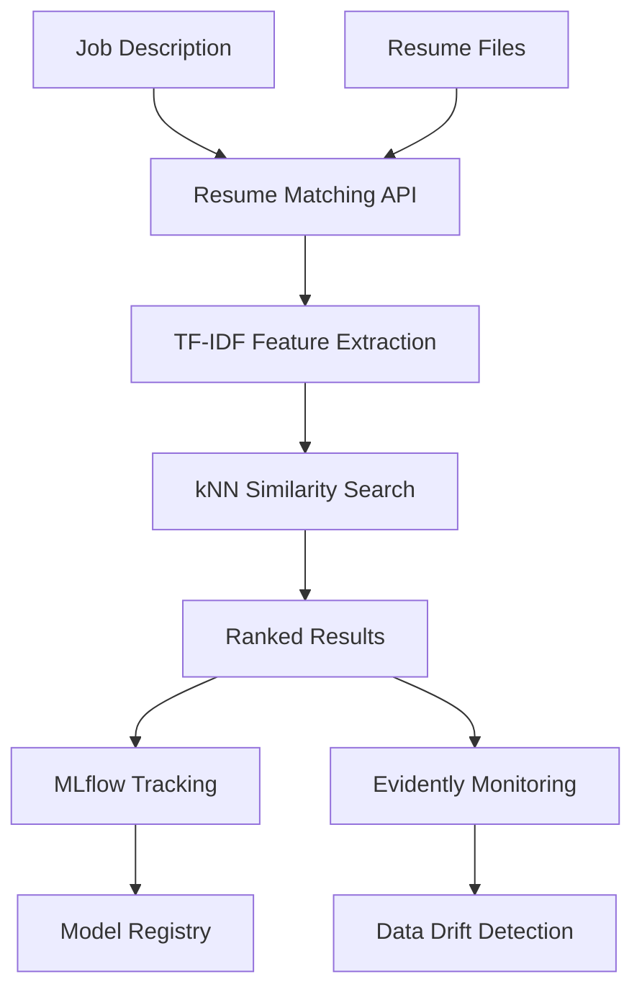

# AI-Powered Resume Matching System

**Automatically match resumes with job descriptions using ML and provide intelligent insights**

## 🚀 Quick Start

```bash
git clone https://github.com/your-username/resume-matcher.git
cd resume-matcher
make dev
```

## 📋 Make Targets

| Target | Description |
|--------|-------------|
| `make dev` | Start development environment |
| `make test` | Run tests with coverage |
| `make lint` | Run linting (ruff + black) |
| `make docker` | Build Docker image |
| `make docker-run` | Run Docker container |
| `make clean` | Clean build artifacts |
| `make security` | Run security audit |
| `make mlflow` | Start MLflow server |
| `make evidently` | Start Evidently dashboard |

## 🏗️ Architecture



## 🔧 Development Setup

### Prerequisites
- Python 3.11+
- Docker (optional)
- Git

### Installation
```bash
# Clone repository
git clone https://github.com/your-username/resume-matcher.git
cd resume-matcher

# Install dependencies
make install

# Start development server
make dev
```

### Environment Variables
Copy `.env.example` to `.env` and configure:
```bash
cp .env.example .env
```

## 🧪 Testing

```bash
# Run all tests
make test

# Run with coverage
pytest tests/ -v --cov=src --cov-report=html

# Run specific test file
pytest tests/test_api.py -v
```

## 🐳 Docker

```bash
# Build image
make docker

# Run container
make docker-run

# Development with Docker Compose
make docker-dev
```

## 📊 Monitoring

### MLflow
```bash
make mlflow
# Access at http://localhost:5000
```

### Evidently Dashboard
```bash
make evidently
# Access at http://localhost:7000
```

## 🔒 Security

```bash
# Run security audit
make security

# Check for vulnerabilities
pip-audit --desc
```

## 📚 API Documentation

Once running, access the interactive API documentation:
- **Swagger UI**: http://localhost:8000/docs
- **ReDoc**: http://localhost:8000/redoc

### Example Usage

```bash
# Match a resume
curl -X POST "http://localhost:8000/match" \
  -H "Content-Type: multipart/form-data" \
  -F "resume_file=@resume.pdf" \
  -F "job_description=Looking for Python developer with ML experience" \
  -F "threshold=0.7"
```

## 🚨 FAQ

### Common Build Errors

**Q: ImportError: No module named 'src'**
A: Make sure you're in the project root directory and run `pip install -e .`

**Q: Docker build fails**
A: Ensure Docker is running and you have sufficient disk space

**Q: Port 8000 already in use**
A: Change the port in the command: `uvicorn src.main:app --port 8001`

### Windows Setup
```bash
# Install Python 3.11 from python.org
# Install Git from git-scm.com
# Use PowerShell or WSL for better compatibility
```

### Mac Setup
```bash
# Install via Homebrew
brew install python@3.11 git

# Or use pyenv
pyenv install 3.11.0
pyenv local 3.11.0
```

## 🤝 Contributing

See [CONTRIBUTION.md](CONTRIBUTION.md) for team member details and task assignments.

## 📄 License

This project is licensed under the MIT License - see the [LICENSE](LICENSE) file for details.

## 📞 Support

For questions or issues, please open an issue on GitHub or contact the team.