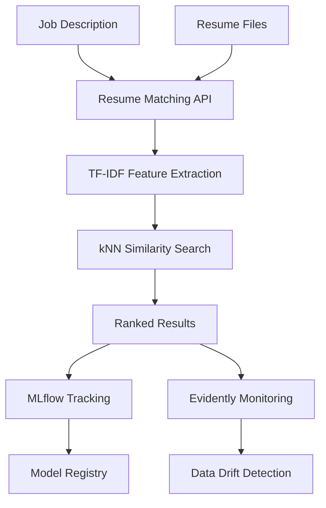

# AI-Powered Resume Matching System

**Automatically match resumes with job descriptions using ML and provide intelligent insights**

## 🚀 Quick Start

```bash
git clone https://github.com/your-username/resume-matcher.git
cd resume-matcher
make dev
```

## 📋 Make Targets

| Target | Description |
|--------|-------------|
| `make dev` | Start development environment |
| `make test` | Run tests with coverage |
| `make lint` | Run linting (ruff + black) |
| `make docker` | Build Docker image |
| `make docker-run` | Run Docker container |
| `make clean` | Clean build artifacts |
| `make security` | Run security audit |
| `make mlflow` | Start MLflow server |
| `make evidently` | Start Evidently dashboard |

## 🏗️ Architecture


```mermaid
graph TD
    A[Job Description] --> B[Resume Matching API]
    C[Resume Files] --> B
    B --> D[TF-IDF Feature Extraction]
    D --> E[kNN Similarity Search]
    E --> F[Ranked Results]
    F --> G[MLflow Tracking]
    F --> H[Evidently Monitoring]
    G --> I[Model Registry]
    H --> J[Data Drift Detection]
```

## 🔧 Development Setup

### Prerequisites
- Python 3.11+
- Docker (optional)
- Git

### Installation
```bash
# Clone repository
git clone https://github.com/your-username/resume-matcher.git
cd resume-matcher

# Install dependencies
make install

# Start development server
make dev
```

### Environment Variables
Copy `.env.example` to `.env` and configure:
```bash
cp .env.example .env
```

## 🧪 Testing

```bash
# Run all tests
make test

# Run with coverage
pytest tests/ -v --cov=src --cov-report=html

# Run specific test file
pytest tests/test_api.py -v
```

## 🐳 Docker

```bash
# Build image
make docker

# Run container
make docker-run

# Development with Docker Compose
make docker-dev
```

## 📊 Monitoring

### MLflow
```bash
make mlflow
# Access at http://localhost:5000
```

### Evidently Dashboard
```bash
make evidently
# Access at http://localhost:7000
```

## 🔒 Security

```bash
# Run security audit
make security

# Check for vulnerabilities
pip-audit --desc
```

## 📚 API Documentation

Once running, access the interactive API documentation:
- **Swagger UI**: http://localhost:8000/docs
- **ReDoc**: http://localhost:8000/redoc

### Example Usage

```bash
# Match a resume
curl -X POST "http://localhost:8000/match" \
  -H "Content-Type: multipart/form-data" \
  -F "resume_file=@resume.pdf" \
  -F "job_description=Looking for Python developer with ML experience" \
  -F "threshold=0.7"
```

## 🚨 FAQ

### Common Build Errors

**Q: ImportError: No module named 'src'**
A: Make sure you're in the project root directory and run `pip install -e .`

**Q: Docker build fails**
A: Ensure Docker is running and you have sufficient disk space

**Q: Port 8000 already in use**
A: Change the port in the command: `uvicorn src.main:app --port 8001`

### Windows Setup
```bash
# Install Python 3.11 from python.org
# Install Git from git-scm.com
# Use PowerShell or WSL for better compatibility
```

### Mac Setup
```bash
# Install via Homebrew
brew install python@3.11 git

# Or use pyenv
pyenv install 3.11.0
pyenv local 3.11.0
```

## 🤝 Contributing

See [CONTRIBUTION.md](CONTRIBUTION.md) for team member details and task assignments.

## ☁️ Cloud Integration (D9)

We integrated our project with **AWS Cloud** as part of the MLOps workflow.

### Services Used
1. **Amazon EC2** — hosts our FastAPI-based inference service.
2. **Amazon S3** — used for storing and retrieving resumes.

### EC2 Instance Details
- Instance type: t3.micro (Free Tier)
- Region: Europe (Stockholm) eu-north-1
- Public IP: 13.51.56.78
- Instance ID: i-0e206c363852fd33b

### S3 Bucket Details
- Bucket name: resume-matcher-bucket-sahil
- Region: Europe (Stockholm) eu-north-1
- Uploaded sample resume files (3 dummy resumes).

### Screenshots
| Description | Screenshot |
|--------------|-------------|
| EC2 instance running |  |
| FastAPI test response |  |
| S3 bucket with uploaded files |  |

---

> **Note:** These screenshots show successful EC2 + S3 integration with a dummy FastAPI app.  
> Once the final Dockerized application is ready, the EC2 app will be updated and redeployed.


## 📄 License

This project is licensed under the MIT License - see the [LICENSE](LICENSE) file for details.

## 📞 Support

For questions or issues, please open an issue on GitHub or contact the team.
## ☁️ Cloud Deployment

Screenshots added in the D9 cloud integration folder in root.

### Services Used
- **Amazon EC2:** Hosts both backend (FastAPI API) and frontend (Streamlit UI) containers.
- **Amazon ECR:** Stores Docker images for frontend and backend built by GitHub Actions.
- **Amazon S3:** Stores raw dataset (`job_title_des.csv`) accessed by backend during inference.
- **IAM Role:** `mlflow-s3-access-role` attached to EC2 grants secure S3 access.

### Architecture Overview
The workflow integrates AWS services as follows:

1. **Model & Data Storage:** Training data (`job_title_des.csv`) resides in an S3 bucket.
2. **Continuous Deployment:**  
   - On each `git push`, GitHub Actions builds and pushes Docker images to Amazon ECR.  
   - The EC2 instance then pulls these images and runs them via Docker.
3. **Serving:**  
   - Backend (FastAPI) runs on port 8000 and serves `/match_resume` API.  
   - Frontend (Streamlit) runs on port 8501, sends resume text to backend API, and displays job matches.

### How to Reproduce
1. Launch an EC2 instance with Ubuntu or Amazon Linux 2023.  
2. Install Docker and AWS CLI, then authenticate to ECR:  
   ```bash
   aws ecr get-login-password --region eu-north-1 | docker login --username AWS --password-stdin <ACCOUNT_ID>.dkr.ecr.eu-north-1.amazonaws.com

Pull and run images:

docker pull <ACCOUNT_ID>.dkr.ecr.eu-north-1.amazonaws.com/resume-frontend:<tag>
docker pull <ACCOUNT_ID>.dkr.ecr.eu-north-1.amazonaws.com/resume-backend:<tag>
docker run -d -p 8000:8000 resume-backend
docker run -d -p 8501:8501 resume-frontend

Interaction Between Components

The frontend sends resume text to http://<EC2_PUBLIC_IP>:8000/match_resume.
The backend loads job descriptions from S3, computes similarity scores, and returns results.
All logs and health checks are viewable via EC2 and Docker.