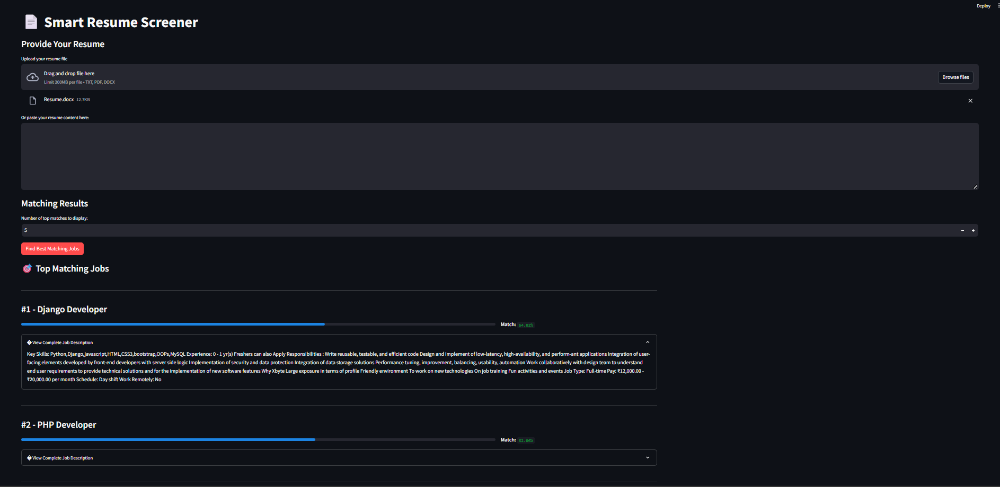
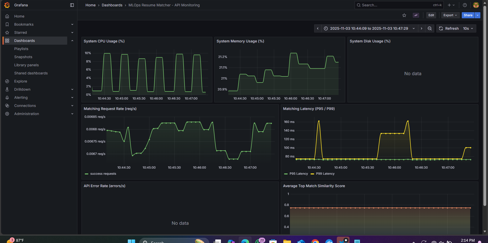

# MLOps Resume Matcher

<p align="center">
  
  
  
  
  
</p>

An end-to-end MLOps pipeline that intelligently matches resumes to job descriptions using semantic search. This project is built with a production-grade stack, featuring an **interactive Streamlit UI**, a scalable FastAPI backend, real-time monitoring, CI/CD, and automated workflows.

### Eperience the app live: 
* Frontend: http://16.16.197.220:8501
* Backend: http://16.16.197.220:8000/docs
---

### 📖 Table of Contents
*   [Core Concept](#-core-concept-semantic-matching)
*   [🚀 Project Workflow & First-Time Setup](#-project-workflow--first-time-setup)
*   [🖼️ Application Showcase](#️-application-showcase)
*   [🛠️ Technology Stack](#-technology-stack)
*   [💻 Development & CI/CD Workflow](#-development--cicd-workflow)
*   [📐 Architecture](#-architecture)
*   [🔬 Monitoring & Observability](#-monitoring--observability)
*   [🔌 API Documentation](#-api-documentation)
*   [☁️ Cloud Deployment on AWS](#️-cloud-deployment-on-aws)
*   [⚙️ Makefile Commands](#️-makefile-commands)
*   [🤔 Troubleshooting & FAQ](#-troubleshooting--faq)

---

### 💡 Core Concept: Semantic Matching

This project moves beyond simple keyword matching. It understands the *meaning* behind the text in resumes and job descriptions.

1.  **Embedding Generation**: A state-of-the-art `SentenceTransformer` model converts both resumes and job descriptions into high-dimensional numerical vectors (embeddings).
2.  **Similarity Search**: By calculating the **cosine similarity** between a resume's embedding and the pre-computed embeddings of all job descriptions, we can find the jobs that are most contextually and semantically related.

---

### 🚀 Project Workflow & First-Time Setup

Follow these steps to get the entire stack—from data setup to a live API and UI—running on your local machine using Docker.

**Prerequisites**:
-   Docker & Docker Compose
-   Git
-   AWS CLI (configured with your credentials)
-   Jupyter Notebook or JupyterLab

#### Step 1: Clone & Configure
```bash
# Clone the repository and navigate into it
git clone https://github.com/your-username/your-repo-name.git
cd your-repo-name

# Create the environment file from the example
cp .env.example .env

# ‼️ ACTION: Open the .env file and add your AWS credentials.
```

#### Step 2: Create the S3 Bucket
This bucket will store your datasets, models, and MLflow artifacts.
```bash
aws s3 mb s3://my-resume-data-store
```

#### Step 3: Run One-Time Setup Tasks
These tasks are performed by running Jupyter notebooks.

1.  **Upload raw data (Resume.csv, job_title_des.csv) to S3**
    -   Open and run the `notebooks/data_to_AWS.ipynb` notebook.

2.  **Generate job embeddings and log model artifacts to MLflow & S3**
    -   Open and run the `notebooks/model_train.ipynb` notebook.

#### Step 4: Launch the Full MLOps Stack
This command starts all services (UI, API, MLflow, Prometheus, Grafana, and Evidently) in the background.
```bash
make run
```

#### Step 5: Explore the Live Application!
All services are now running and accessible via `localhost`.

| Service | URL | Notes |
| :--- | :--- | :--- |
| **➡️ Interactive UI (Streamlit)** | **`http://localhost:8501`** | The main user interface. |
| **API Docs (Swagger)** | `http://localhost:8000/docs` | For testing the backend API. |
| **MLflow UI** | `http://localhost:5000` | Track experiments and models. |
| **Grafana Dashboard** | `http://localhost:3000` | Monitor real-time performance. |
| **Prometheus UI** | `http://localhost:9090` | View raw scraped metrics. |
| **Evidently Dashboard** | `http://localhost:7000` | Shows reports after running the monitoring notebook. |

---

### 🖼️ Application Showcase

Here's a preview of the key components of the MLOps Resume Matcher in action.

**Interactive UI (Streamlit)**
*The user-facing interface for matching resumes.*


**Monitoring Dashboard (Grafana)**
*Real-time monitoring of API and system performance.*


**Experiment Tracking (MLflow)**
*Tracking models, artifacts, and parameters.*


**Data Drift Report (Evidently)**
*Visualizing drift in the resume text data.*


---

### 🛠️ Technology Stack

This project leverages a modern, production-ready stack for building and managing machine learning systems.

| Category | Technology | Purpose |
| :--- | :--- | :--- |
| **Backend** | **FastAPI** | High-performance Python framework for building the REST API. |
| | **Uvicorn** | ASGI server for running the FastAPI application. |
| **Frontend** | **Streamlit** | Python library for creating the interactive web UI. |
| **ML/NLP** | **Sentence-Transformers** | Framework for generating state-of-the-art text embeddings (using a BERT-based model). |
| | **PyTorch** | Core deep learning framework for handling tensors and models. |
| | **Pandas** | Data manipulation and analysis. |
| **MLOps & Monitoring**| **MLflow** | For experiment tracking, model logging, and artifact storage. |
| | **Evidently AI** | For data and model quality monitoring, including drift detection. |
| | **Prometheus** | Time-series database for collecting real-time metrics. |
| | **Grafana** | For visualizing metrics and creating monitoring dashboards. |
| | **Prometheus FastAPI Instrumentator** | To automatically instrument the FastAPI app for Prometheus. |
| **CI/CD & Automation**| **GitHub Actions** | For orchestrating the CI/CD pipeline (lint, test, build, deploy). |
| | **Docker & Docker Compose** | For containerizing all services and managing the local stack. |
| | **Pre-commit** | For running automated checks (linting, secret scanning) before commits. |
| **Cloud & Storage** | **AWS S3** | Object storage for datasets, models, and MLflow artifacts. |
| | **AWS EC2** | Virtual servers for hosting the application in the cloud. |

---

### 💻 Development & CI/CD Workflow

This project is built with a focus on automation, code quality, and a robust CI/CD pipeline.

#### **Testing Strategy**
-   **Framework**: `pytest` is used for writing and running tests.
-   **Coverage**: The CI pipeline enforces a **minimum of 80% code coverage**.
-   **Execution**: Run all tests with `make test`.

#### **Pre-commit Hooks**
-   Before any code is committed, `pre-commit` automatically runs checks to ensure code quality and prevent secrets from being leaked.
-   **Hooks**: `trailing-whitespace`, `end-of-file-fixer`, `detect-secrets`.

#### **Continuous Integration (CI) Pipeline**
-   **Definition**: The CI pipeline is defined in `.github/workflows/ci.yml` and runs on `push` to `main` and on pull requests.
-   **Jobs**:
    1.  **Lint**: Enforces code style with `ruff` and `black`.
    2.  **Test**: Runs the `pytest` suite and fails if coverage is below 80%.
    3.  **Build**: Builds and pushes the API's Docker image to GitHub Container Registry (GHCR).
    4.  **Canary Deploy & Acceptance Tests**: Deploys the new image to a canary environment and runs a "golden set" of tests against it to validate production readiness.

---

### 📐 Architecture

The architecture is designed to be modular, scalable, and observable, following best practices for MLOps.

1.  **Data & Model Storage (AWS S3)**: S3 acts as the single source of truth. It stores the raw CSV datasets, the trained **BERT-based Sentence-Transformer model**, the pre-computed job embeddings, and all MLflow experiment artifacts. This decouples data from the application logic.

2.  **Backend API (FastAPI)**: A containerized FastAPI application serves the core matching logic. On startup, it loads the model and job embeddings from S3 into memory. It exposes a `POST /match_resume` endpoint that takes resume text, generates an embedding in real-time, and performs a cosine similarity search against the pre-computed job embeddings to find the best matches.

3.  **Frontend UI (Streamlit)**: A separate containerized Streamlit application provides a user-friendly interface. It communicates with the FastAPI backend, sending user-provided resume text to the API and displaying the returned job matches in a clean, readable format.

4.  **Monitoring Stack**:
    -   **Prometheus**: Scrapes metrics from the FastAPI API (instrumented via `prometheus-fastapi-instrumentator`).
    -   **Grafana**: Visualizes the metrics from Prometheus in a custom dashboard, providing insights into API latency, request rate, and system health.
    -   **Evidently AI**: Runs in its own container and provides a UI for viewing data drift and model performance reports, which can be generated on-demand via notebooks.

5.  **Experiment Tracking (MLflow)**: MLflow is used to log the model training (embedding generation) process. It records the model used, parameters, and the output `job_embeddings.pt` file, all stored in the S3 artifact store.

6.  **CI/CD (GitHub Actions)**: The entire workflow is automated. On every push, GitHub Actions lints the code, runs tests, and builds Docker images. On merge to main, it can be configured to deploy the new images to a production environment (like AWS EC2).

---

### 🔬 Monitoring & Observability

This project includes a comprehensive monitoring stack to ensure reliability and performance.

#### **MLflow: Experiment Tracking**
-   **Access**: `http://localhost:5000`
-   **Experiment**: `Resume_Job_Matcher`
-   **Details**: View the embedding model used, the resulting job embeddings tensor, and other parameters.

#### **Evidently AI: Data & Model Drift**
-   **Access**: `http://localhost:7000`
-   **Purpose**: The Evidently UI starts automatically and monitors the workspace for new reports. To generate a drift report, run the `notebooks/04_evidently_monitoring.ipynb` notebook. The new report will then appear in the UI.

#### **Grafana: Real-time Dashboards**
-   **Access**: `http://localhost:3000` (login: `admin`/`admin`)
-   **Key Panels**:
    -   **Matching Request Rate**: Tracks API throughput from both UI and direct calls.
    -   **Matching Latency (P95)**: Monitors user-facing response time.
    -   **Average Top Match Score**: A proxy for model performance.
    -   **System Metrics**: CPU, Memory, and Disk usage.

---

### 🔌 API Documentation

The API is self-documenting via FastAPI and Swagger UI.

-   **Interactive Docs**: **`http://localhost:8000/docs`**

#### `POST /match_resume`
Accepts resume text and returns the top N best-matching job descriptions.

**cURL Example**:
```bash
curl -X POST "http://localhost:8000/match_resume" \
  -H "Content-Type: application/json" \
  -d '{
    "resume_text": "Software engineer skilled in Python, Django, and cloud services like AWS.",
    "top_n": 5
  }'
```

---

### ☁️ Cloud Deployment on AWS

This application is designed for and deployed on Amazon Web Services (AWS), leveraging core services for compute and storage. Screenshots added in the D9 cloud integration folder in root.

#### **AWS Services Used**

1.  **Amazon EC2 (Elastic Compute Cloud)**
    -   **Purpose**: Serves as the virtual server that hosts the entire Dockerized application stack (API, UI, MLflow, Prometheus, Grafana, Evidently).
    -   **Rationale**: EC2 provides complete control over the server environment, making it ideal for running a multi-container Docker Compose application.

2.  **Amazon S3 (Simple Storage Service)**
    -   **Purpose**: Acts as the central, durable object store for all data and model artifacts, decoupling storage from compute.
    -   **Stores**: Raw data (`.csv`), model artifacts (SentenceTransformer files), generated embeddings (`.pt`), and MLflow experiment data.
 
3.  **Amazon ECR:** 
    -   **Purpose** Stores Docker images for frontend and backend built by GitHub Actions.

4.  **IAM Role:** 
    -   **Purpose** `mlflow-s3-access-role` attached to EC2 grants secure S3 access.

#### **How the ML Workflow Interacts with AWS**

1.  **Setup**: The `notebooks/data_to_AWS.ipynb` notebook sends raw datasets to the **S3 bucket**.
2.  **Training (Embedding)**: The `notebooks/model_train.ipynb` notebook reads data from **S3**, generates embeddings, and logs the model and embeddings tensor back to **S3** via MLflow.
3.  **Inference**: The FastAPI application on **EC2** loads the model and embeddings from **S3** into memory on startup for fast, real-time matching.


---

### ⚙️ Makefile Commands

A `Makefile` is included for easy access to common commands. Run `make help` for a full list.

-   `make run`: Starts all Docker services.
-   `make stop`: Stops all services.
-   `make logs`: Tails the logs from all running services.
-   `make test`: Runs the test suite.
-   `make lint`: Checks code quality.

---

### 🤔 Troubleshooting & FAQ

**Q: The `make` command is not found.**
-   **A:** The `make` utility is not installed by default on Windows.
    -   **Windows**: The easiest way is to install it via Chocolatey. Open an **Administrator PowerShell** and run: `choco install make`.
    -   **macOS**: Install it via Homebrew: `brew install make`, or install the Xcode Command Line Tools.

**Q: The API or Streamlit UI starts, but returns a "Model not loaded" error.**
-   **A:** This is the most common issue and means the one-time setup scripts were not run. The API needs the model files and pre-computed job embeddings to be present in your S3 bucket before it can start.
    -   **Solution**: Make sure you have successfully run both setup commands from **Step 3** of the "First-Time Setup" guide.
    -   **Verify**: Check your S3 bucket to confirm that the `models/` and `data/` directories exist and contain files. You can also check the API logs (`make logs`) for more specific error messages during startup.

**Q: How do I see a data drift report in the Evidently UI?**
-   **A:** The Evidently UI service starts automatically with `make run` and is available at `http://localhost:7000`, but it will be empty at first. To generate a report for it to display:
    1.  Make sure all your services are running.
    2.  Execute all the cells in the `notebooks/04_evidently_monitoring.ipynb` notebook.
    3.  Refresh your browser at `http://localhost:7000`. The new drift report will now appear in the project list.

**Q: My Grafana dashboard is empty or showing "No Data".**
-   **A:** This is usually due to one of two reasons:
    1.  **Time**: Prometheus needs a minute or two to start scraping metrics from the API after the services start. Wait a moment and refresh the dashboard.
    2.  **No Traffic**: The application-specific panels (like Request Rate and Latency) will only show data after you send requests to the API. Use the Streamlit UI or a `curl` command to make a few matching requests, and you will see the data appear in Grafana.

**Q: How do I update the application with new job descriptions?**
-   **A:** This requires re-generating the embeddings for the new job list. Follow this workflow:
    1.  Update your local `job_title_des.csv` file.
    2.  Run the `notebooks/data_to_AWS.ipynb` notebook again to push the new file to S3.
    3.  Re-run the `notebooks/model_train.ipynb` notebook. This creates a new `job_embeddings.pt` file.
    4.  Finally, restart your services to force the API to load the new embeddings:
        `make stop && make run`


