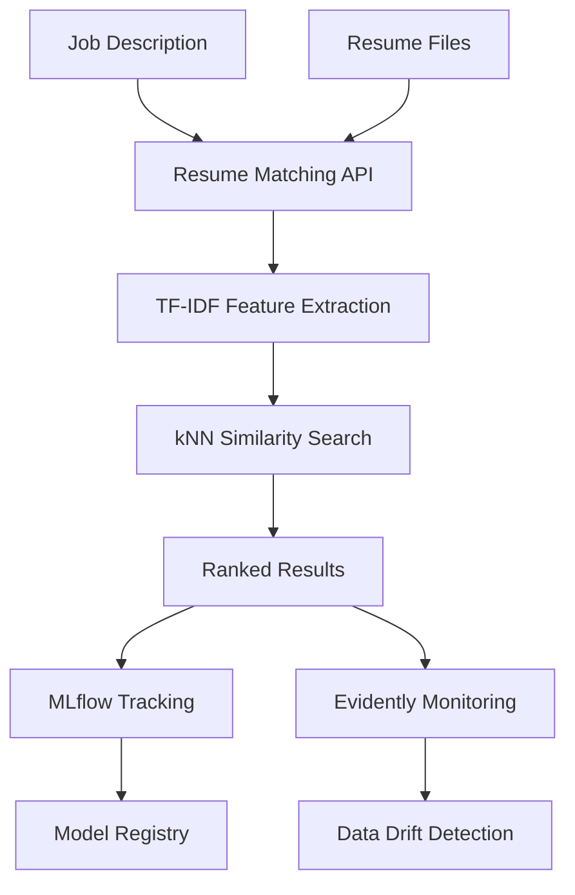

# AI-Powered Resume Matching System

**Automatically match resumes with job descriptions using ML and provide intelligent insights**

## 🚀 Quick Start

```bash
git clone https://github.com/your-username/resume-matcher.git
cd resume-matcher
make dev
```

## 📋 Make Targets

| Target | Description |
|--------|-------------|
| `make dev` | Start development environment |
| `make test` | Run tests with coverage |
| `make lint` | Run linting (ruff + black) |
| `make docker` | Build Docker image |
| `make docker-run` | Run Docker container |
| `make clean` | Clean build artifacts |
| `make security` | Run security audit |
| `make mlflow` | Start MLflow server |
| `make evidently` | Start Evidently dashboard |

## 🏗️ Architecture


```mermaid
graph TD
    A[Job Description] --> B[Resume Matching API]
    C[Resume Files] --> B
    B --> D[TF-IDF Feature Extraction]
    D --> E[kNN Similarity Search]
    E --> F[Ranked Results]
    F --> G[MLflow Tracking]
    F --> H[Evidently Monitoring]
    G --> I[Model Registry]
    H --> J[Data Drift Detection]
```

## 🔧 Development Setup

### Prerequisites
- Python 3.11+
- Docker (optional)
- Git

### Installation
```bash
# Clone repository
git clone https://github.com/your-username/resume-matcher.git
cd resume-matcher

# Install dependencies
make install

# Start development server
make dev
```

### Environment Variables
Copy `.env.example` to `.env` and configure:
```bash
cp .env.example .env
```

## 🧪 Testing

```bash
# Run all tests
make test

# Run with coverage
pytest tests/ -v --cov=src --cov-report=html

# Run specific test file
pytest tests/test_api.py -v
```

## 🐳 Docker

```bash
# Build image
make docker

# Run container
make docker-run

# Development with Docker Compose
make docker-dev
```

## 📊 Monitoring

### MLflow
```bash
make mlflow
# Access at http://localhost:5000
```

### Evidently Dashboard
```bash
make evidently
# Access at http://localhost:7000
```

## 🔒 Security

```bash
# Run security audit
make security

# Check for vulnerabilities
pip-audit --desc
```

## 📦 Data Version Control (DVC)

We use DVC to track and version control our datasets and models.

### Setup DVC
```bash
# Install DVC (already in requirements.txt)
pip install dvc dvc-s3

# Initialize DVC (already done)
# dvc init

# Configure remote storage (update with your S3 bucket)
dvc remote add -d storage s3://your-bucket-name/dvc-storage
```

### Track Data Files
```bash
# Track a dataset
dvc add data/resumes.csv

# Track model files
dvc add models/resume_model.pkl

# Commit the .dvc files to git
git add data/resumes.csv.dvc models/resume_model.pkl.dvc .gitignore
git commit -m "Track datasets and models with DVC"
```

### Pull Data
```bash
# Pull data from remote storage
dvc pull

# Pull specific file
dvc pull data/resumes.csv.dvc
```

### Push Data
```bash
# Push data to remote storage
dvc push

# Push specific file
dvc push data/resumes.csv.dvc
```

## 📚 API Documentation

Once running, access the interactive API documentation:
- **Swagger UI**: http://localhost:8000/docs
- **ReDoc**: http://localhost:8000/redoc
- **Prometheus Metrics**: http://localhost:8000/metrics

### API Endpoints

#### Health Check
```bash
curl -X GET "http://localhost:8000/health"
```

**Response:**
```json
{
  "status": "ok"
}
```

#### Predict Similarity
```bash
curl -X POST "http://localhost:8000/predict" \
  -H "Content-Type: application/json" \
  -d '{
    "resumes": [
      "Software Engineer with 5 years of Python experience and ML expertise",
      "Data Scientist with strong background in machine learning"
    ],
    "job_descriptions": [
      "Looking for Python developer with ML experience",
      "Need ML expert for data science role"
    ]
  }'
```

**Response:**
```json
{
  "similarity_matrix": [
    [0.85, 0.72],
    [0.68, 0.91]
  ]
}
```

**JSON Schema:**
```json
{
  "PredictionRequest": {
    "resumes": ["string"],
    "job_descriptions": ["string"]
  },
  "PredictionResponse": {
    "similarity_matrix": [[float]]
  }
}
```

### cURL Examples

**Single Resume vs Single Job:**
```bash
curl -X POST "http://localhost:8000/predict" \
  -H "Content-Type: application/json" \
  -d '{
    "resumes": ["Python developer with ML skills"],
    "job_descriptions": ["Looking for Python ML engineer"]
  }'
```

**Multiple Resumes vs Multiple Jobs:**
```bash
curl -X POST "http://localhost:8000/predict" \
  -H "Content-Type: application/json" \
  -d '{
    "resumes": [
      "Python developer",
      "Java developer",
      "Full stack developer"
    ],
    "job_descriptions": [
      "Need Python expert",
      "Looking for Java specialist"
    ]
  }'
```

**Check Metrics:**
```bash
curl -X GET "http://localhost:8000/metrics"
```

## 🚨 FAQ

### Common Build Errors

**Q: ImportError: No module named 'src'**
A: Make sure you're in the project root directory and run `pip install -e .`

**Q: Docker build fails**
A: Ensure Docker is running and you have sufficient disk space

**Q: Port 8000 already in use**
A: Change the port in the command: `uvicorn src.main:app --port 8001`

### Windows Setup
```bash
# Install Python 3.11 from python.org
# Install Git from git-scm.com
# Use PowerShell or WSL for better compatibility
```

### Mac Setup
```bash
# Install via Homebrew
brew install python@3.11 git

# Or use pyenv
pyenv install 3.11.0
pyenv local 3.11.0
```

## 🤝 Contributing

See [CONTRIBUTION.md](CONTRIBUTION.md) for team member details and task assignments.

## 📄 License

This project is licensed under the MIT License - see the [LICENSE](LICENSE) file for details.

## 📞 Support

For questions or issues, please open an issue on GitHub or contact the team.